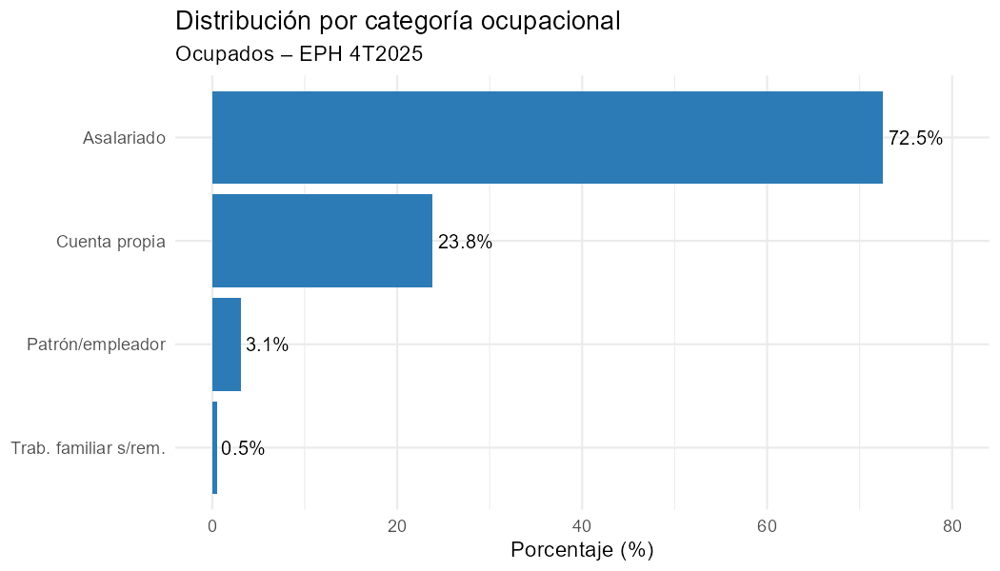
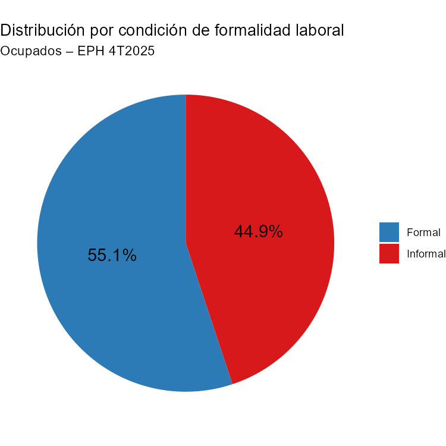
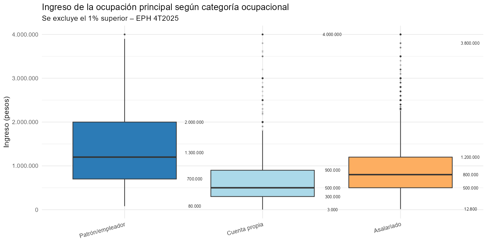
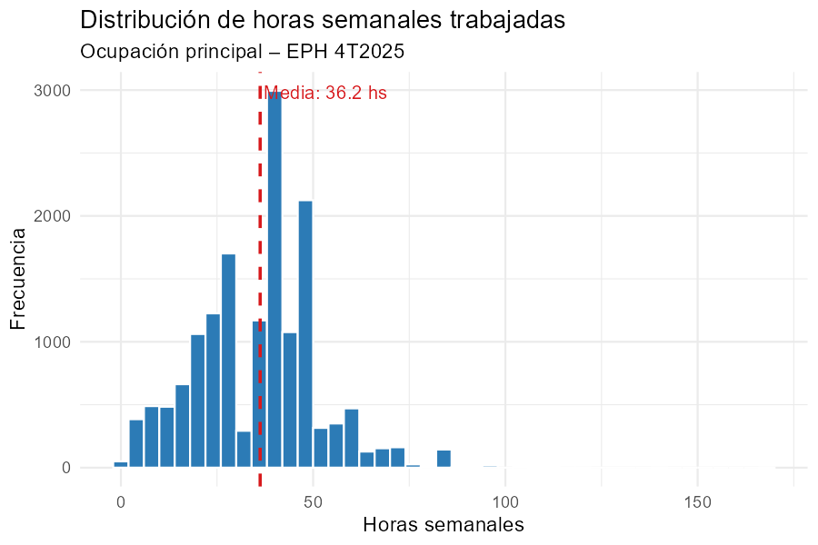

```{r setup, include=FALSE}
knitr::opts_chunk$set(echo = FALSE, message = FALSE, warning = FALSE,
                      fig.pos = "H")
library(tidyverse)
library(psych)

datos         <- readRDS("datos_EPH.rds")
datos_ingreso <- datos %>% filter(Ingreso_mensual_ARS > 0)

tabla_cat <- datos %>%
  count(Cat_ocupacional) %>%
  mutate(Porcentaje = round(n / sum(n) * 100, 1))

tabla_form <- datos %>%
  count(Formalidad) %>%
  mutate(Porcentaje = round(n / sum(n) * 100, 1))

tabla_form_valida <- tabla_form %>%
  filter(Formalidad != "Sin dato") %>%
  mutate(Pct = round(n / sum(n) * 100, 1))

med_cat <- datos_ingreso %>%
  group_by(Cat_ocupacional) %>%
  summarise(Mediana = round(median(Ingreso_mensual_ARS)))

pesos <- function(x) paste0("\\$", format(round(x), big.mark = "."))
```

## 1. Introducción y planteo del problema

La Encuesta Permanente de Hogares (EPH) es un programa de producción estadística del INDEC que releva las condiciones socioeconómicas de la población en los principales aglomerados urbanos del país. La **unidad de análisis** es cada persona ocupada residente en dichos aglomerados durante el 4° trimestre de 2025. La **población** de referencia son los ocupados en los 31 aglomerados urbanos cubiertos por la EPH.

Se analizan cuatro variables:

| Variable | Tipo | Parámetro de interés |
|---|---|---|
| Categoría ocupacional | Cualitativa nominal | Proporción por categoría ($\pi$) |
| Formalidad laboral | Cualitativa nominal | Proporción formal/informal ($\pi$) |
| Ingreso mensual (P21) | Cuantitativa continua | Media ($\mu$) y mediana poblacional |
| Horas semanales (PP3E_TOT) | Cuantitativa discreta | Media ($\mu$) y mediana poblacional |

Los valores calculados a partir de la muestra son **estadísticos** que permiten estimar los parámetros poblacionales.

## 2. Descripción de la muestra

La EPH utiliza un diseño muestral **probabilístico, estratificado y bietápico**, por lo que los resultados son estimaciones representativas de la población urbana argentina, no un censo.

De los registros disponibles, se retuvieron **`r nrow(datos)` ocupados** con datos completos en las cuatro variables. La variable Formalidad presenta `r tabla_form %>% filter(Formalidad == "Sin dato") %>% pull(n)` casos sin dato (`r tabla_form %>% filter(Formalidad == "Sin dato") %>% pull(Porcentaje)`%), correspondientes principalmente a patrones y cuentapropistas para quienes el campo EMPLEO no fue declarado; estos casos se excluyen del análisis de formalidad. El INDEC clasifica como ocupados a los trabajadores familiares sin remuneración (`r tabla_cat %>% filter(Cat_ocupacional == "Trab. familiar s/rem.") %>% pull(Porcentaje)`% de la muestra), quienes participan del análisis ocupacional y de horas pero son excluidos del análisis de ingresos al no percibir remuneración.

## 3. Análisis descriptivo

### Categoría ocupacional

```{r g1, fig.align='center', out.width='78%', fig.cap="Distribución de ocupados por categoría ocupacional. EPH 4T2025."}

```

La categoría predominante es la de **asalariados**, que concentra al `r tabla_cat %>% filter(Cat_ocupacional == "Asalariado") %>% pull(Porcentaje)`% de los ocupados. El `r tabla_cat %>% filter(Cat_ocupacional == "Cuenta propia") %>% pull(Porcentaje)`% trabaja por cuenta propia, mientras que los patrones o empleadores representan el `r tabla_cat %>% filter(Cat_ocupacional == "Patrón/empleador") %>% pull(Porcentaje)`%.

### Formalidad laboral

```{r g2, fig.align='center', out.width='52%', fig.cap="Distribución por condición de formalidad laboral (sobre casos con dato). EPH 4T2025."}

```

Entre los ocupados con dato de formalidad, el **`r tabla_form_valida %>% filter(Formalidad == "Formal") %>% pull(Pct)`% son trabajadores formales** y el `r tabla_form_valida %>% filter(Formalidad == "Informal") %>% pull(Pct)`% son informales.

### Ingreso mensual de la ocupación principal

```{r g3, fig.align='center', out.width='100%', fig.cap="Distribución del ingreso mensual según categoría ocupacional. Se excluye el 1\\% superior. EPH 4T2025."}

```

La distribución del ingreso es **fuertemente asimétrica hacia la derecha** (coeficiente de asimetría = `r round(skew(datos_ingreso$Ingreso_mensual_ARS), 2)`): la media (`r pesos(mean(datos_ingreso$Ingreso_mensual_ARS))`) supera ampliamente a la mediana (`r pesos(median(datos_ingreso$Ingreso_mensual_ARS))`), evidenciando valores atípicos elevados. La mitad de los ocupados percibió menos de `r pesos(median(datos_ingreso$Ingreso_mensual_ARS))` mensuales. El coeficiente de variación del `r round(100 * sd(datos_ingreso$Ingreso_mensual_ARS) / mean(datos_ingreso$Ingreso_mensual_ARS), 1)`% refleja una alta dispersión. Los patrones registran la mediana más alta (`r pesos(med_cat %>% filter(Cat_ocupacional=="Patrón/empleador") %>% pull(Mediana))`), mientras que los cuentapropistas presentan los valores más bajos (`r pesos(med_cat %>% filter(Cat_ocupacional=="Cuenta propia") %>% pull(Mediana))`).

### Horas semanales trabajadas

```{r g5, fig.align='center', out.width='75%', fig.cap="Distribución de horas semanales trabajadas en la ocupación principal. EPH 4T2025."}

```

La distribución de horas semanales es **levemente asimétrica hacia la izquierda** (coeficiente de asimetría = `r round(skew(datos$Horas_semanales), 2)`). La mitad de los ocupados trabaja `r median(datos$Horas_semanales)` horas o más por semana; la concentración en torno a las 40 horas es consistente con la jornada laboral legal. El coeficiente de variación del `r round(100 * sd(datos$Horas_semanales) / mean(datos$Horas_semanales), 1)`% indica menor dispersión que la variable de ingresos.

## 4. Conclusión

El análisis descriptivo de los ocupados en Argentina durante el 4T2025 revela una estructura laboral dominada por asalariados, con una proporción significativa de informalidad. La distribución del ingreso es marcadamente asimétrica con valores atípicos hacia arriba, por lo que la mediana resulta el indicador más representativo del ingreso típico. Las horas semanales presentan una distribución más homogénea, concentrada en la jornada de 40 horas.

Dado que los resultados provienen de una muestra probabilística representativa de los aglomerados urbanos, **las conclusiones son de carácter preliminar**: los estadísticos calculados estiman los parámetros poblacionales con un margen de error asociado al diseño muestral de la EPH.
